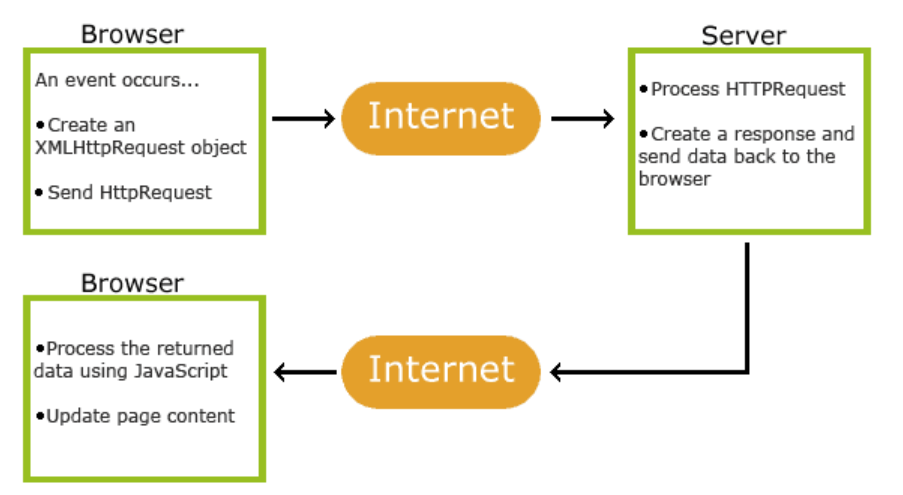

# JavaScript
* JavaScript is a client-side scripting language of web developed at Netscape by Breden Eich in 1995 with the name LiveScript.
* JavaScript is used to build interactive websites with dynamic features and to validate form data.
* JavaScript is also known as the Programming Language of web as it is the only programming language for Web browsers. 
* JavaScript is an object-based scripting language which is lightweight and cross-platform.
* The programs in this language are called scripts.

# JavaScript Facts
Some popular facts about JavaScript.

* JavaScript is the only client-side scripting (i.e. browser interpreted) language.
* JavaScript can build interactivity Websites.
* JavaScript is Object-Based and Event (click, hover key press, load, scroll etc) based programming language.
* JavaScript is Case Sensitive.
* JavaScript can put dynamic content into a webpage.
* JavaScript can react to events like Click, mouse over, mouse out, form submit etc known as JavaScript Events.
* JavaScript can validate form data.
* JavaScript can detect user browser using navigator Object.
* JavaScript can be used to create cookies.
* JavaScript can add cool animation to a webpage JS timing functions.
* JavaScript can detect user physical location using HTML5 Geolocation API.
* JavaScript can also be used to draw shapes, graphs, create animations and games development using HTML5 Canvas.
* At present, JavaScript has lot of libraries and framework, exp JQuery, Angular JS, React JS, Backbone JS etc, thus making JavaScript more popular.

# Benefits of JAVASCRIPT
* Web Develpomet
* Desktop App Development
* Mobile App Development

# Write JavaScript in Webpage
Based on where JavaScript coding is written, JavaScript is categorized in three parts, Internal JavaScript, External JavaScript, and Inline JavaScript. 
1. Internal JavScript :- In Internal JavaScript, JavaScript coding is written inside head or body within
```<script> tag``` 
    ``` 
    <script>
      document.write('Hello Javascript');
    </script>
    ```

2. External JavaScript :- In External JavaScript, javascript code is written in external file with .js extension and then linked with script tag.
   ```
   <script src="custom.js"></script>  
   ```

3. Inline JavaScript :- In Inline JavaScript, javascript code is written directly inside html tags. All though this is not recommended. Script should be written in separate file( external) or in ```<script> tag.```
   ```
   <button onclick="alert('Hello JS')">Check</button>
   
   <marquee onmouseover="stop()" onmouseout="start()">Hello Javascript</marquee>
   
   <a href="javascript:void(0)" onclick="print()">Print</a>
   ```
NOTE: Write JavaScript coding in head tag only when we want script to execute first, like to disable text selection, page redirection, notifications etc. Rest all script like JQuery, Angular JS or custom JS should be written just before body closing tag.

# JavaScript Dialog Box
JavaScript supports three dialog box. These dialog boxes are build in functions of window object. Three dialog box in JavaScript are alert, prompt and confirm.
1) alert():- Alert box, i.e alert() or window.alert() is used to show output in dialog box. For alerts, use alert(). Alert generally block the code, thus next code block will run only after alert is closed. 
   ```
   Example : 
   <script>
     var x = 'hello js';
     alert(x);
   </script>
   ```
2) prompt():- prompt() or window.prompt() dialog box is used to receive input from user.
   ```
   Example :
   <script>
     var x = prompt('Enter Name');
     alert(x);
   </script>
   ```
3) confirm():- confirm() or window.confirm() dialog box is used to get confirmation from user. This will show Ok or Cancel in dialog box.
   ```
   Example :
   <script>
     var x = confirm('Press Ok or Cancel');
     alert(x);
   </script>
   ```
* Noscript Tag :- This tag is an html element used when JavaScript is disabled in web browser. If JavaScript is enable, noscript tag is invisible.
* NOTE :- If we want to add any html tag inside js then that tag should be in double quotes.

# Variables
There are three variables: Var, Let, Const
* How to write varibale name: 1) firstname, 2) first_name, 3) first-name, 4) firstName, 5) firstname99
* NOTE: If we display a variable which has no value then output would be "undefined"
* Difference between Var & let :- 
1. var -> It has function scope means it's visible throughout the function. <br>
          We can access variable using var before it's declaration <br>
          We can redeclare the variable using var and it will not lose it's value.
 2. let -> It has block scope means it's visible only where it is declared. <br>
           We can't access variable using var before it's declaration
 <br>
  Example -

    ```
    function example() {
      console.log(x); // Outputs: undefined
      var x = 5;
      console.log(x); // Outputs: 5
    }
  
    example();
  
    console.log(y); // Throws ReferenceError: y is not defined
    let y = 10;
    console.log(y); // Outputs: 10
    ```

# Data Types
* var x = "Hello"; --> String
* var x = 123; ---> Number
* var x = true / false ---> Boolean
* var x = ["a", "b"]; ---> Array
* var x = {first : "Jane", last : "Doe"}; ---> Object
* var x = null; ---> Null
* var x; ---> Undefined
* var x = BigInt("123456789012345678901234567890"); ---> BigInt

# Operators
* Arithmetic Operator: +, -, *, ** (Exponentiation), /, %, ++, --
* Assignment Operator: =, +=, -=, *=, **=, /*. %=
* Comparison Operator: ==, === (equal value and equal type), !=, !==, >, <, >=, <=
* Logical Operator: &&, ||, !
* Conditional Operator: (Condition) ? True Statement : False Statement

# Array Iteration 
### forEach() -> 
The forEach() method calls a function (a callback function) once for each array element. 
```
const numbers = [45, 4, 9, 16, 25];
let txt = "";
numbers.forEach(myFunction);

function myFunction(value, index, array) {
  txt += value + "<br>";
}
```

### map() ->
The map() method creates a new array by performing a function on each array element.
```
const numbers1 = [45, 4, 9, 16, 25];
const numbers2 = numbers1.map(myFunction);

function myFunction(value) {
  return value * 2;
}
```

### filter() ->
The filter() method creates a new array with array elements that pass a test. 
```
const numbers = [45, 4, 9, 16, 25];
const over18 = numbers.filter(myFunction);

function myFunction(value) {
  return value > 18;
}
```

### reduce() ->
It is used to produce a single value output. It works from left to right in array. 
```
const numbers = [45, 4, 9, 16, 25];
let sum = numbers.reduce(myFunction);

function myFunction(total, value) {
  return total + value;
}
```

### reduceRight() -> 
Same as reduce() method but the difference is; it works from right to left in array. 

### every() ->
The every() method checks if all array values pass a test. It produces output as true/ false.
```
const numbers = [45, 4, 9, 16, 25];
let allOver18 = numbers.every(myFunction);

function myFunction(value) {
  return value > 18;
}
```

### some() ->
The some() method checks if some array values pass a test.

### indexOf() & lastIndexOf() ->
The indexOf() method searches an array for an element value and returns its position whereas Array.lastIndexOf() returns the position of the last occurrence of the specified element.

### find() & findIndex() ->
The find() method returns the value of the first array element that passes a test function. <br>
The findIndex() method returns the index of the first array element that passes a test function.

### from() ->
The Array.from() method returns an Array object from any object with a length property or any iterable object.
```
<script>
  const myArr = Array.from("ABCDEFG");
  document.getElementById("demo").innerHTML = myArr;
</script>

O/P :- A,B,C,D,E,F,G
```

### keys() ->
The Array.keys() method returns an Array Iterator object with the keys of an array.
```
const fruits = ["Banana", "Orange", "Apple", "Mango"];
const keys = fruits.keys();

for (let x of keys) {
  text += x + "<br>";
}

O/P :- 1 2 3 4 in seperate lines.
```

### entries() ->
The entries() method returns an Array Iterator object with key/value pairs :
```
[0, "Banana"]
[1, "Orange"]
[2, "Apple"]
[3, "Mango"]
```

# Date
### Creating Date Object :-
* <b>Syntax</b> -> var now = new Date();
* There are 9 ways to create it -
1. new Date()
2. new Date(date string)
3. new Date(year,month)
4. new Date(year,month,day)
5. new Date(year,month,day,hours)
6. new Date(year,month,day,hours,minutes)
7. new Date(year,month,day,hours,minutes,seconds)
8. new Date(year,month,day,hours,minutes,seconds,ms)
9. new Date(milliseconds)

### Methods to displaying dates :- 
toString() , toDateString() , toUTCString() , toISOString()

### Date Methods :- 
toDateString(), getDate(), getFullYear(), getMonth(), getDay(), getHours(), getMinutes(), getSeconds(), getMilliseconds(), setDate(), setFullYear(), setHours(), setMilliseconds(), setMinutes(), setMonth(), setSeconds()

### UTC Date Get Methods :-
getUTCDate(), getUTCFullYear(), getUTCMonth(), getUTCDay(), getUTCHours(), getUTCMinutes(), getUTCSeconds(), getUTCMilliseconds()

### The getTimezoneOffset() Method :-
The getTimezoneOffset() method returns the difference (in minutes) between local time and UTC time.

## The Nullish Coalescing Operator (??) :- 
The ?? operator returns the first argument if it is not nullish (null or undefined). Otherwise it returns the second argument.
```
let name = null;
let text = "missing";
let result = name ?? text;
console.log(result);

O/P :- missing
```

## The Optional Chaining Operator (?.) :-
The ?. operator returns undefined if an object is undefined or null (instead of throwing an error).
```
const car = {type:"Fiat", model:"500", color:"white"};
// Ask for car name:
document.getElementById("demo").innerHTML = car?.name;

O/P :- Undefined 
```

# Events 
* Click (onclick), Double Click (ondblclick), Right Click (oncontextmenu), Mouse Hover (onmouseenter), Mouse Out (onmouseout), Mouse Down (onmousedown), Mouse Up (onmouseup), Key Press (onkeypress), Key Up (onkeyup), Load (onload), Unload (onunload), Resize (onresize), Scroll (onscroll).  
NOTE: onkeypress works on body tag or inside form tag. 

# Loops
### While Loop
```
Initialize Variable
while(condition){
  Statement
  Increment / Decrement 
}
```
### Do While Loop
```
Initialize Variable
do{
  statement
  Increment / Decrement 
}while(condition)
```
### For Loop
```
for(var initialization; condition; increment/decrement)
```
### for/in Loop
* Used to print the value of object
```
for(var i in a){
  statement
}
```

# Array Methods
```
sort(), reverse(), pop()--> delete the value of last index, push()--> add the value in last index, shift()--> delete first element, unshift()--> add the value in starting index, concat(), join(), slice(), splice(), isArray(), indexOf(), lastIndexOf(), entries(), every()--> It checks every value of array , filter()--> it creates an aaray filled with all elements that passes a test   , find(), findIndex(), includes(), some()--> it checks if any of the elements in array pass a test , foreach(), toString()--> converts an array into String and returns the result , valueOf()--> returns the array, fill()--> fill all elements in array with static value . 
```
# Object
* It is advanced version of array. 
* Syntax 
```
var a = {index_name(properties) : value};
```
* We can create array into object. 
* We can multiple functions inside object. 

# String Methods
```
length--> Property, toLowerCase(), toUpperCase(), includes(), startsWith(), endsWith(), search(), match(), indexOf(), lastIndexOf(), replace(), trim(), charAt(), charCodeAt(), fromCharCode(), concat(), split(), repeat(), slice(), substr(), substring(), toString(), valueOf().
```
# Number Methods
```
number(), parseInt(), parseFloat(), isFinite(), isInteger(), toFixed(x), toPrecision()
```
# Math Methods
* Used in animations, vedio game development, complex accouting web applications
```
ceil(), floor(), round(), trunc(), max(x,y,z...n), min(x,y,z...n), sqrt(), cbrt(), pow(x,y), random(), abs(x), PI
``` 

## JavaScript Objects vs Maps

<table border="1">
  <tr>
    <th>S.No.</th>
    <th>Object</th>
    <th>Map</th>
  </tr>
  <tr>
    <td>Iterable</td>
    <td>Not directly iterable</td>
    <td>Directly iterable</td>
  </tr>
  <tr>
    <td>Size</th>
    <td>Do not have a size property</td>
    <td>Have a size property</td>
  </tr>
  <tr>
    <td>Key Types</td>
    <td>Keys must be Strings (or Symbols)</td>
    <td>Keys can be any datatype</td>
  </tr>
  <tr>
    <td>Key Order</td>
    <td>Keys are not well ordered</td>
    <td>Keys are ordered by insertion</td>
  </tr>
  <tr>
    <td>Defaults</td>
    <td>Have default keys</td>
    <td>Do not have default keys</td>
  </tr>
</table>

# Regular Expression :-
* A regular expression is a sequence of characters that forms a search pattern.
* The search pattern can be used for text search and text replace operations.
* <b> Syntax:- </b> /pattern/modifiers;
* regular expressions are often used with the two string methods: search() and replace().<br>
<b> Examples :- </b>
```
let text = "Visit W3Schools";         |   let text = "Visit Microsoft!";
let n = text.search(/w3schools/i);    |   let result = text.replace(/microsoft/i, "W3Schools");
```

## Regular Expression Modifiers :-
```
Modifier	    Description	
  i	            Perform case-insensitive matching	
  g	            Perform a global match (find all matches rather than stopping after the first match)	
  m	            Perform multiline matching
```

# Error Name Values :-
```
Error Name	                      Description
  EvalError	                     An error has occurred in the eval() function
  RangeError	                 A number "out of range" has occurred
  ReferenceError	             An illegal reference has occurred
  SyntaxError	                 A syntax error has occurred
  TypeError	                     A type error has occurred
  URIError	                     An error in encodeURI() has occurred
```
## Arrow Function :-
<b>Syntax :- </b> let myFunc(a, b) => a*b;

# Modules :-
* JavaScript modules allow you to break up your code into separate files.
* Modules are imported from external files with the import statement.
* Modules also rely on type="module" in the script tag.
```
<script type="module">
import message from "./message.js";
</script>
```

# Export :-
* Modules with functions or variables can be stored in any external file.
* There are two types of exports: Named Exports and Default Exports.

<b> A) Named Export :- </b>
Let us create a file named person.js, and fill it with the things we want to export. You can create named exports two ways. In-line individually, or all at once at the bottom.
```
In-line individually:
person.js

export const name = "Jesse";
export const age = 40;
```
```
All at once at the bottom:
person.js

const name = "Jesse";
const age = 40;

export {name, age};
```

<b> B) Default Export :- </b>
Let us create another file, named message.js, and use it for demonstrating default export. You can only have one default export in a file.
```
message.js

const message = () => {
const name = "Jesse";
const age = 40;
return name + ' is ' + age + 'years old.';
};

export default message;
```

# Import :-
You can import modules into a file in two ways, based on if they are named exports or default exports. Named exports are constructed using curly braces. Default exports are not.
```
Import named exports from the file person.js:

import { name, age } from "./person.js";    
```
```
Import a default export from the file message.js:

import message from "./message.js";
```

# Converting a JSON Text to a JavaScript Object :-
* JSON is JavaScript Object Notation used to when data is sent from server to web page. 
* First, create a JS string containing JSON syntax :-
```
let text = '{ "employees" : [' +
'{ "firstName":"John" , "lastName":"Doe" },' +
'{ "firstName":"Anna" , "lastName":"Smith" },' +
'{ "firstName":"Peter" , "lastName":"Jones" } ]}';
```
* Then use built-in function <b> JSON.parse() </b> to convert string into JSON object.
```
const obj = JSON.parse(text);
```
* Finally, use the new JavaScript object in your page:
```
<p id="demo"></p>
<script>
document.getElementById("demo").innerHTML =
obj.employees[1].firstName + " " + obj.employees[1].lastName;
</script>
```
## JSON.stringify() :-
Any JavaScript object can be stringified (converted to a string) with the JavaScript function JSON.stringify():
```
const person = {
  name: "John",
  age: 30,
  city: "New York"
};

let myString = JSON.stringify(person);
document.getElementById("demo").innerHTML = myString; 

O/P :- {"name":"John","age":30,"city":"New York"}
```

## Nested Object :-
```
myObj = {
  name:"John",
  age:30,
  cars: {
    car1:"Ford",
    car2:"BMW",
    car3:"Fiat"
  }
}
```
* We can access it :- myObj.cars.car1 OR myObj.cars[car1] OR myObj["cars"]["car2"];

## Object.defineProperty() :-
```
// Define object
const obj = {counter : 0};

// Define setters and getters
Object.defineProperty(obj, "reset", {
  get : function () {this.counter = 0;}
});
Object.defineProperty(obj, "increment", {
  get : function () {this.counter++;}
});
Object.defineProperty(obj, "decrement", {
  get : function () {this.counter--;}
});
Object.defineProperty(obj, "add", {
  set : function (value) {this.counter += value;}
});
Object.defineProperty(obj, "subtract", {
  set : function (value) {this.counter -= value;}
});

// Play with the counter:
obj.reset;
obj.add = 5;
obj.subtract = 1;
obj.increment;
obj.decrement;
```

## Prototype Inheritance :-
* All JavaScript objects inherit properties and methods from a prototype:
* Date objects inherit from Date.prototype
* Array objects inherit from Array.prototype
* Person objects inherit from Person.prototype
* The Object.prototype is on the top of the prototype inheritance chain: Date objects, Array objects, and Person objects inherit from Object.prototype.
* The JavaScript prototype property allows you to add new properties to object constructors:
```
function Person(first, last, age, eyecolor) {
  this.firstName = first;
  this.lastName = last;
  this.age = age;
  this.eyeColor = eyecolor;
}

Person.prototype.nationality = "English";
```

# Function
* A function is a group of statements that perform specific tasks and can be kept and maintained separately from main program. Functions provide a way to create reusable code packages that are more portable and easier to debug.
* <i><b>typeof opertor</b></i> can check the datatype of the function. 
* JavaScript functions are first-class objects. This means they are very powerful in JavaScript as compared to other programming languages. They are even more powerful than objects.
* <b>Why JavaScript Functions are first-class objects?</b>
    1. Functions can be assigned to variables.
    2. Functions can have properties and methods.
    3. Functions can return functions.
    4. Functions can have callbacks.
* Advanges :- Code reusability, Less Coding, Eliminates errors
```
function functionName(){ <-- Function Definition
    Statement
}   
functionName(); <-- Calling a function
```
* Gobal Variable --> It works inside function or outside the function.
* Local Variable --> It works only inside the function.
# Function hoisting
* The function hoisting is a mechanism that the JavaScript engine physically moves function declarations to the top of the code before executing them.

## Self-Invoking Functions :-
Function expressions will execute automatically if the expression is followed by ().
```
(function () {
  let x = "Hello!!";  // I will invoke myself
})();
```

## Function Rest Parameter :-
The rest parameter (...) allows a function to treat an indefinite number of arguments as an array:
```
function sum(...args) {
  let sum = 0;
  for (let arg of args) sum += arg;
  return sum;
}

let x = sum(4, 9, 16, 25, 29, 100, 66, 77);
```

## The JavaScript call() Method :-
* The call() method is a predefined JavaScript method.
* It can be used to call a method with an owner object as an argument.
```
const person = {
  fullName: function() {
    return this.firstName + " " + this.lastName;
  }
}
const person1 = {
  firstName:"John",
  lastName: "Doe"
}
const person2 = {
  firstName:"Mary",
  lastName: "Doe"
}

// This will return "John Doe":
person.fullName.call(person1);
```

## The JavaScript apply() Method :-
* The apply() method is similar to the call() method.
* In this example the fullName method of person is applied on person1:
```
const person = {
  fullName: function() {
    return this.firstName + " " + this.lastName;
  }
}

const person1 = {
  firstName: "Mary",
  lastName: "Doe"
}

// This will return "Mary Doe":
person.fullName.apply(person1);
```

## The Difference Between call() and apply() :-
* The call() method takes arguments separately whereas The apply() method takes arguments as an array.
* <b> The apply() Method with Arguments :- </b>
```
const person = {
  fullName: function(city, country) {
    return this.firstName + " " + this.lastName + "," + city + "," + country;
  }
}

const person1 = {
  firstName:"John",
  lastName: "Doe"
}

person.fullName.apply(person1, ["Oslo", "Norway"]);
```
* Compared with the call() method: 
```
const person = {
  fullName: function(city, country) {
    return this.firstName + " " + this.lastName + "," + city + "," + country;
  }
}

const person1 = {
  firstName:"John",
  lastName: "Doe"
}

person.fullName.call(person1, "Oslo", "Norway");
```

## JavaScript Function bind() :-
* With the bind() method, an object can borrow a method from another object.
```
const person ={
  fName : "Sneha",
  lName : "Varshney",
  fullName : function(){
    return this.fName + " " + this.lName;
  }
}
const member = {
  fName : "Sanaya",
  lName : "Gupta",
}
let fullName = person.fullName.bind(member);
```
# Class Inheritance 
* To create a class inheritance, use the extends keyword.
* The super keyword is used to call the constructor of its parent class to access the parent's properties and methods.
* A class created with a class inheritance inherits all the methods from another class:
```
class Car{
  constructor(brand){
    this.carName = brand;
  }
  present(){
    return 'I have a' + this.carName;
  }
}
class Model extends Car{
  constructor(brand, model){
    super(brand);
    this.model = model;
  }
  show(){
    return this.present() + ', it is a ' + this.model;
  }
}
let myCar = new Model("Ford", "Mustang");
document.getElementById("demo").inneHTML = myCar.show();
```

# Static Methods
* Static class methods are defined on the class itself.
* You cannot call a static method on an object, only on an object class.
```
class Car {
  constructor(name) {
    this.name = name;
  }
  static hello() {
    return "Hello!!";
  }
}

let myCar = new Car("Ford");

// You can call 'hello()' on the Car Class:
document.getElementById("demo").innerHTML = Car.hello();

// But NOT on a Car Object:
// document.getElementById("demo").innerHTML = myCar.hello();
// this will raise an error.

//If you want to use the myCar object inside the static method, you can send it as a parameter:
//document.getElementById("demo").innerHTML = Car.hello(myCar);
```

# Waiting for a Timeout 
When using the JavaScript function setTimeout(), you can specify a callback function to be executed on time-out:
```
setTimeout(myFunc, 3000);
function myFunc(){
  document.getElementById("demo").innerHTML = "Say Hello";
}
```

# Waiting for Intervals:
When using the JavaScript function setInterval(), you can specify a callback function to be executed for each interval:
```
setInterval(myFunction, 1000);

function myFunction() {
  let d = new Date();
  document.getElementById("demo").innerHTML=
  d.getHours() + ":" +
  d.getMinutes() + ":" +
  d.getSeconds();
}
```

# Promise Object
* A JavaScript Promise object contains both the producing code and calls to the consuming code.
* <b>Syntax :- </b>
```
myPromise.then(
  function(value) { /* code if successful */ },
  function(error) { /* code if some error */ }
);
```
```
function myDisplayer(some) {
  document.getElementById("demo").innerHTML = some;
}

let myPromise = new Promise(function(myResolve, myReject) {
  let x = 0;

// The producing code (this may take some time)

  if (x == 0) {
    myResolve("OK");
  } else {
    myReject("Error");
  }
});

myPromise.then(
  function(value) {myDisplayer(value);},
  function(error) {myDisplayer(error);}
);
```

# Async 
* The keyword async before a function makes the function return a promise:
```
async function myFunction() {
  return "Hello";
}
myFunction().then(
  function(value) {myDisplayer(value);},
  function(error) {myDisplayer(error);}
);
```
# Await
* The await keyword can only be used inside an async function.
* The await keyword makes the function pause the execution and wait for a resolved promise before it continues: <br>
let value = await promise;
```
async function myDisplay() {
  let myPromise = new Promise(function(resolve, reject) {
    resolve("I love You !!");
  });
  document.getElementById("demo").innerHTML = await myPromise;
}

myDisplay();
```

# HTML DOM - Document Object Model
When a web page is loaded, the browser creates DOM. <br>
HTML DOM is a standard for how to get, change. add or delete HTML elements. <br>
The HTML DOM model is constructed as a tree of objects- <br>

            document
                |
            root (html)
              /      \
    element : <head>     element : <body>
            |                 /           \
    element : <title>     element : <nav>   element : <h1>
            |                     |                 |
    Text : 'New Website'  elemenr : <a>     Text : 'Welcome'
                                  |               |
                          Text : 'About Us'  attribute : 'id'
                                  |                 |
                          attribute : 'class'   attribute : 'class'

* With the object model, JS gets all the power it needs to create dynamic HTML:  
1. JS can change all the Html elements, attributes in the page.
2. JS can change all the CSS Style in the page.
3. JS can remove existing HTML elements and attributes.
4. JS can add new HTML elements and attributes. 
5. JS can create new HTML events in the page. 
<br>
              
* How to target DOM Object -> By ID, By Class Name, By Tag Name
* <b>DOM Targeting Model</b> --> document, document.all, document.documentElement, document.head, document.title, document.body, document.images, document.anchors, document.links, document.forms, document.doctype, document.URL, document.baseURI, document.domain, getElementById(), getElementsByClassName(), getElementsByTagName()
* What we can get with DOM --> HTML, Text, Attribute
* <b>DOM Get Method</b> --> innerText, innerHTML, getAttribute, getAttributeNode, attributes
* <b>DOM Set Method</b> --> innerText, innerHTML, setAttribute, Attribute, removeAttribute
* <b>DOM Targeting Methods</b> 1) querySelector -> document.querySelector(CSS Selector), 2) querySelectorAll -> document.querySelectorAll(CSS Selector)
* <b> DOM CSS Styling Methods:</b> 1. Style, 2. className, 3. classList
* <b><u>Assign Event Using the HTML DOM --></u> </b><br>
document.getElementById(Id).onclick = functionName;<br>
* <b><u>addEventListener() Method --></u></b><br>
document.getElementById(Id).addEventListner("click", functionName);
* <b>UseCapture :- </b><br>
addEventListner(event, function, useCapture);
* <b>removeEventListener() Method --> </b><br>
element.removeEventListner(eventName, functionName);
* <b><u>classList Methods: </u></b>
1) add(class1, class2, ....),  2) remove(class1, class2, ...),  3) toogle(class), 4) contains(class), 5) item(index), 6) Length  
* <b><u>Traversal Methods: </u></b>
parentNode, parentElement, children, childNodes, firstChild, firstElementChild, lastChild, lastElementChild, nextElementSibling, nextSibling, previousElementSibling, previousSibling 

## HTML DOM Document Object
1. Finding HTML Elements
<table border="1">
  <tr>
    <td>document.getElementById(id)</td>
    <td>Find an element by element id </td>
  </tr>
  <tr>
    <td>document.getElementsByTagName(name)	</td>
    <td>Find elements by tag name </td>
  </tr>
  <tr>
    <td>document.getElementsByClassName(name)	</td>
    <td>Find elements by class name </td>
  </tr>
</table>

2. Changing HTML Elements
<table border="1">
  <tr>
    <td>element.innerHTML =  new html content</td>
    <td>Change the inner HTML of an element</td>
  </tr>
  <tr>
    <td>element.attribute = new value	</td>
    <td>Change the attribute value of an HTML element </td>
  </tr>
  <tr>
    <td>element.style.property = new style</td>
    <td>Change the style of an HTML element</td>
  </tr>
  <tr>
    <td>element.setAttribute(attribute, value)	</td>
    <td>Change the attribute value of an HTML element</td>
  </tr>
</table>

3. Adding and Deleting HTML Elements
<table border="1">
  <tr>
    <td>document.createElement(element)	</td>
    <td>Create an HTML element</td>
  </tr>
  <tr>
    <td>document.removeChild(element)	</td>
    <td>Remove an HTML element</td>
  </tr>
  <tr>
    <td>document.appendChild(element)	</td>
    <td>Add an HTML element</td>
  </tr>
  <tr>
    <td>document.replaceChild(new, old)	</td>
    <td>Replace an HTML element</td>
  </tr>
  <tr>
    <td>document.write(text)	</td>
    <td>Write into the HTML output stream</td>
  </tr>
</table>

## Finding HTML Elements
1. By Id -> <br>
document.getElementById("Id");

2. By Tag Name -> <br>
document.getElementByTagName("p");

```
const x = document.getElementById("main");
const y = x.getElementsByTagName("p");

This example finds the element with id="main", and then finds all <p> elements inside "main"
```

3. By Class Name -> <br>
document.getElementByClassName("class");

4. By CSS Selector -> <br>
document.querySelectorAll("p.intro"); <br>
will return a list of all &lt;p&gt; elements with class="intro".

## Changing HTML Content 

### Change HTML Element -
The easiest way to modify the content of an HTML element is by using <b>innerHTML</b> property.
```
document.getElementById(id).innerHTML = new HTML
```

### Change the Value of HTML Attribute
To modify the attribute use this syntax -
```
document.getElementById(id).attribute = new value
```

## FORMS
HTML Form validation can be done by JavaScript.

### HTML Constraint Validation
* HTML5 introduced a new HTML validation concept called constraint validation.
* HTML constraint validation is based on:
1. Constraint validation HTML Input Attributes
2. Constraint validation CSS Pseudo Selectors
3. Constraint validation DOM Properties and Methods

A. Constraint validation HTML Input Attributes
<table border="1">
  <tr>
    <th>Attribute</th>
    <th>Description</th>
  </tr>
  <tr>
    <td>disabled</td>
    <td>Specifies that the input element should be disabled</td>
  </tr>
  <tr>
    <td>max</td>
    <td>Specifies the maximum value of an input element</td>
  </tr>
  <tr>
    <td>min</td>
    <td>Specifies the minimum value of an input element</td>
  </tr>
  <tr>
    <td>pattern</td>
    <td>Specifies the value pattern of an input element</td>
  </tr>
  <tr>
    <td>required</td>
    <td>Specifies that the input field requires an element</td>
  </tr>
  <tr>
    <td>type</td>
    <td>Specifies the type of an input element</td>
  </tr>
</table>

B. Constraint validation CSS Pseudo Selectors
<table border="1">
  <tr>
    <th>Selector</th>
    <th>Description</th>
  </tr>
  <tr>
    <td>:disabled</td>
    <td>Selects input elements with the "disabled" attribute specified</td>
  </tr>
  <tr>
    <td>:invalid</td>
    <td>Selects input elements with invalid values</td>
  </tr>
  <tr>
    <td>:optional</td>
    <td>Selects input elements with no "required" attribute specified</td>
  </tr>
  <tr>
    <td>:required</td>
    <td>Selects input elements with the "required" attribute specified</td>
  </tr>
  <tr>
    <td>:valid</td>
    <td>Selects input elements with valid values</td>
  </tr>     
</table>

## Changing HTML Style
* Use this syntax to change the style -
```
document.getElementById(id).style.property = new style
```

## DOM Animation
* Animating element on a web page using javascript and CSS properties that manipulates the structure and style of the HTML elements.
* This includes animations like changing element positions, sizes, color, opacity and more.\
* We don't have to use @keyframes here for animation.

## DOM Events 
* These  are actions or occurrences that happen in the HTML document or within its elements, triggered by user interactions or system events.
* Examples of DOM events include mouse clicks, key presses, form submissions, page load, and more.

<table border="1">
  <tr>
    <th>Mouse Events</th>
    <th>Description</th>
  </tr>
  <tr>
    <td>click</td>
    <td>Triggered when the mouse button is clicked.</td>
  </tr>
  <tr>
    <td>dblclick</td>
    <td>Triggered when the mouse button is double-clicked.</td>
  </tr>
  <tr>
    <td>mouseover</td>
    <td>Triggered when the mouse pointer moves over an element.</td>
  </tr>
  <tr>
    <td>mouseout</td>
    <td>Triggered when the mouse pointer moves out of an element.</td>
  </tr>
  <tr>
    <td>mousedown</td>
    <td>Triggered when a mouse button is pressed down over an element.</td>
  </tr>   
  <tr>
    <td>mouseup</td>
    <td>Triggered when a mouse button is released over an element.</td>
  </tr>  
</table>

<table border="1">
  <tr>
    <th>Keyboard Events</th>
    <th>Description</th>
  </tr>
  <tr>
    <td>keydown</td>
    <td>Triggered when a key is pressed down.</td>
  </tr>
  <tr>
    <td>keyup</td>
    <td>Triggered when a key is released.</td>
  </tr>
  <tr>
    <td>keypress</td>
    <td>Triggered when a key is pressed and released.</td>
  </tr>
</table>

<table border="1">
  <tr>
    <th>Form Events</th>
    <th>Description</th>
  </tr>
  <tr>
    <td>submit</td>
    <td>Triggered when a form is submitted.</td>
  </tr>
  <tr>
    <td>input</td>
    <td>Triggered when the value of an input field changes.</td>
  </tr>
  <tr>
    <td>change</td>
    <td>Triggered when the value of a form element changes and loses focus.</td>
  </tr>
  <tr>
    <td>focus</td>
    <td>Triggered when an element gains focus.</td>
  </tr>
  <tr>
    <td>blur</td>
    <td>Triggered when an element loses focus.</td>
  </tr>     
</table>

<table border="1">
  <tr>
    <th>Window Events</th>
    <th>Description</th>
  </tr>
  <tr>
    <td>load</td>
    <td>Triggered when the window and its content finish loading.</td>
  </tr>
  <tr>
    <td>resize</td>
    <td>Triggered when the window is resized.</td>
  </tr>
  <tr>
    <td>scroll</td>
    <td>Triggered when the document is scrolled.</td>
  </tr>
  <tr>
    <td>unload</td>
    <td>Triggered when the window is being unloaded (e.g., when navigating away from the page).</td>
  </tr>
</table>

## Event Listener

### The addEventListener() method
Add an event listener that fires when a user clicks a button:
```
document.getElementById("myBtn").addEventListener("click", displayDate);
```

### The removeEventListener() method
The removeEventListener() method removes event handlers that have been attached with the addEventListener() method:
```
element.removeEventListener("mousemove", myFunction);
```

## Event Bubbling or Event Capturing?
* <b>Event Propagation : </b> It is a way of defining the element order when an event occurs. <br>
* There are two ways of defining the event propagation- 
1. Event Bubbling
2. Event Capturing

In Bubbling - the inner most element's event is handled first and then outer. Example- If there is a &lt;p&gt; inside &lt;div&gt; then &lt;p&gt will click first then &lt;div&gt;

In Capturing - the outer most element's event is handled first and then inner. Example- If there is a &lt;p&gt; inside &lt;div&gt; then &lt;div&gt will click first then &lt;p&gt;

## Navigation
* DOM navigation refers to the process of traversing and manipulating the structure of the DOM in HTML documents using JavaScript. 
* The DOM represents the hierarchical structure of HTML elements on a web page, where each element is a node in the tree-like structure.
* DOM navigation involves moving between different nodes in the DOM tree, accessing their properties, modifying their content, adding or removing elements, and performing various operations based on the structure of the DOM.
* Here are some common tasks involved in DOM navigation: 
1. <b>Accessing Elements:</b> You can use methods like document.getElementById(), document.getElementsByClassName(), document.getElementsByTagName(), and document.querySelector() to access specific elements in the DOM based on their IDs, classes, tags, or CSS selectors.
2. <b>Traversing the DOM Tree:</b> You can navigate between parent, child, and sibling nodes in the DOM tree using properties like parentNode, childNodes, firstChild, lastChild, nextSibling, and previousSibling.
3. <b>Manipulating Elements:</b> Once you've accessed an element, you can modify its properties, such as textContent, innerHTML, classList, style, etc., to change its content, attributes, styles, and classes.
4. <b>Creating and Removing Elements:</b> You can dynamically create new elements using document.createElement() and append them to the DOM tree using methods like appendChild(), insertBefore(), etc. Similarly, you can remove elements using removeChild().
5. <b>Event Handling:</b> You can attach event handlers to DOM elements using methods like addEventListener() to listen for user interactions (clicks, key presses, etc.) and perform actions based on those events.

## Collections
* The getElementsByTagName() method returns an HTMLCollection object.
* It may look like array but it's not.
* However, you cannot use array methods like valueOf(), pop(), push(), or join() on an HTMLCollection.

## Node Lists
* A NodeList object is a list (collection) of nodes extracted from a document.
* A NodeList object is almost the same as an HTMLCollection object.
* getElementsByClassName() may return either an HTMLCollection or a NodeList depending on the browser version.
* The childNodes property always returns a NodeList containing all child nodes.
* querySelectorAll() consistently returns a NodeList across most browsers, allowing for selection of multiple elements using CSS selectors.

### Difference Between Collections and Node Lists
<table border="1">
  <tr>
    <th>Collections</th>
    <th>Node Lists</th>
  </tr>
  <tr>
    <td>Collections of document elements</td>
    <td>Collections of document nodes</td>
  </tr>
  <tr>
    <td>Can be accessed by their name, id or index no.</td>
    <td>Can be accessed by their index no.</td>
  </tr>
  <tr>
    <td>An HTMLCollection is always a live collection. Example: If you add a <li> element to a list in the DOM, the list in the HTMLCollection will also change.</td>
    <td>A NodeList is most often a static collection. Example: If you add a <li> element to a list in the DOM, the list in NodeList will not change.</td>
  </tr>
  <tr>
    <td>The getElementsByClassName() and getElementsByTagName() methods return a live HTMLCollection.</td>
    <td>The querySelectorAll() method returns a static NodeList.</td>
  </tr>
</table>

### Timing Events -
* The window object allows execution of code at specified time intervals.
* These time intervals are called timing events.
* The two key methods to use with JavaScript are:
1. <u>setTimeout(function, milliseconds) </u> -> 
Executes a function, after waiting a specified number of milliseconds.
2. <u>setInterval(function, milliseconds)</u> ->
Same as setTimeout(), but repeats the execution of the function continuously.

## The Browser Object Model (BOM)
The Browser Object Model (BOM) represents a collection of objects provided by the browser environment, which can be accessed and manipulated using JavaScript. Unlike the DOM, which deals with the elements of a web page, the BOM focuses on the browser window and its components. <br><br>
<b>BOM includes objects such as :- </b><br><br>
<b><u>Window -</u></b>
* The window object represents the browser window and is the top-level object in the BOM hierarchy.
* It provides properties and methods to interact with the browser window, such as resizing the window, opening/closing windows, controlling navigation, handling events, and accessing browser-related information like the URL and history.
* It is supported by all the browsers. 
* Global variables are properties of the window object.
  ```
  var globalVariable = 'Hello';
  console.log(window.globalVariable); 
  // Output: 'Hello'
  ```
* Global functions are methods of the window object.
* Even the document object (of the HTML DOM) is a property of the window object.
  ```
  window.document.getElementById("header"); // Same as document.getElementById("header");
  ```
Methods -
1. Window Size -  There are two prop - window.innerHeight, window.innerWidth (in px)
2. window.open()
3. window.close()
4. window.moveTo()
5. window.resizeTo()

<b><u>Screen -</u></b><br>
&nbsp;&nbsp;&nbsp; The window.screen object contains information about the user's screen. <br>
Properties-
1. screen.width -> returns then total width of the visitor's screen in pixels.
2. screen.height -> returns the height of the visitor's screen in pixels.
3. screen.availWidth -> returns the available width of the visitor's screen (total width - area covered by system element)
4. screen.availHeight -> returns the available height of the visitor's screen (total width - area covered by system element)
5. screen.colorDepth -> returns the number of bits used to display one color.
6. screen.pixelDepth -> returns the number of bits used to represent the color of each pixel on the screen. Higher color depths allow for a wider range of colors and better color accuracy.

<b><u>Location -</u></b><br>
&nbsp;&nbsp;&nbsp; The window.location object can be used to get the current page address (URL) and to redirect the browser to a new page. <br>
Properties -
1. window.location.href -> returns the entire URL of the current document, including the protocol, domain, path, query parameters, and fragment identifier.
2. window.location.protocol -> returns the protocol (e.g., "http:", "https:") of the current URL.
3. window.location.hostname -> returns the hostname and port number of the current URL.
4. window.location.pathname -> returns the path and filename of the current URL.

### Popup Alert -
1. <u>Alert Box </u> -> An alert box is often used if you want to make sure information comes through to the user.<br>
<b>Syntax - </b> window.alert("text");

2. <u>Confirm Box</u> -> A confirm box is often used if you want the user to verify or accept something. <br>
<b>Syntax - </b> window.confirm("text");

3. <u>Prompt Box </u> -> A prompt box is often used if you want the user to input a value before entering a page. <br>
<b>Syntax - </b> window.prompt("sometext","defaultText");

## Cookies -
* Cookies are data, stored in small text files, on your computer.
* When a web server has sent a web page to a browser, the connection is shut down, and the server forgets everything about the user. Cookies were invented to solve the problem "how to remember information about the user":
* When a user visits a web page, his/her name can be stored in a cookie as a name-value pair. Next time the user visits the page, the cookie "remembers" his/her name.
* JavaScript can create, read, and delete cookies with the document.cookie property.

## Web API
* A Web API (Application Programming Interface) is a set of protocols and tools that allows different software applications to communicate and interact with each other over the internet. 
* It defines the methods and rules for how software components should interact, exchange data, and perform operations. <br><br>
There are 2 main types -
  1. Server Side API 
  2. Client Side API (Browser-Side)

1. Server Side :- 
* Server-side APIs are exposed by web servers or server-side applications to provide access to resources, data, and functionalities on the server.
* A Server API can extend the functionality of a web server.
* Common examples of server-side APIs include RESTful APIs, SOAP APIs, GraphQL APIs, database APIs, and server-side programming APIs (e.g., Node.js APIs).

2. Client Side :- 
* Client-side APIs are provided by web browsers to enable web developers to interact with and control the browser environment, user interface, and client-side functionalities.
* They allow developers to manipulate the DOM (Document Object Model), handle user input, make HTTP requests, access device capabilities, store data locally, and perform various client-side tasks.
* Common examples of client-side APIs include the DOM API, Fetch API, Geolocation API, Web Storage API, Canvas API, IndexedDB API, and more.

## Validation API
###  Constraint Validation DOM Methods
<table border="1">
  <tr>
    <th>Properties</th>
    <th>Discription</th>
  </tr>
  <tr>
    <td>checkValidity()</td>
    <td>Returns true if an input element contains valid data.</td>
  </tr>
  <tr>
    <td>setCustomValidity()</td>
    <td>Sets the validationMessage property of an input element.</td>
  </tr>
</table>

### Constraint Validation DOM Properties
<table border="1">
  <tr>
    <th>Properties</th>
    <th>Discription</th>
  </tr>
  <tr>
    <td>validity</td>
    <td>Contains boolean properties related to the validity of an input element.</td>
  </tr>
  <tr>
    <td>validationMessage</td>
    <td>Contains the message a browser will display when the validity is false.</td>
  </tr>
  <tr>
    <td>willValidate</td>
    <td>Indicates if an input element will be validated.</td>
  </tr>
</table>

### Validity Properties
<table border="1">
  <tr>
    <th>Properties</th>
    <th>Discription</th>
  </tr>
  <tr>
    <td>customError</td>
    <td>Set to true, if a custom validity message is set.</td>
  </tr>
  <tr>
    <td>patternMismatch</td>
    <td>Set to true, if an element's value does not match its pattern attribute.</td>
  </tr>
  <tr>
    <td>rangeOverflow</td>
    <td>Set to true, if an element's value is greater than its max attribute.</td>
  </tr>
  <tr>
    <td>rangeUnderflow</td>
    <td>Set to true, if an element's value is less than its min attribute.</td>
  </tr>
  <tr>
    <td>stepMismatch</td>
    <td>Set to true, if an element's value is invalid per its step attribute.</td>
  </tr>
  <tr>
    <td>tooLong</td>
    <td>Set to true, if an element's value exceeds its maxLength attribute.</td>
  </tr>
  <tr>
    <td>typeMismatch</td>
    <td>Set to true, if an element's value is invalid per its type attribute.</td>
  </tr>
  <tr>
    <td>valueMissing</td>
    <td>Set to true, if an element (with a required attribute) has no value.</td>
  </tr>
  <tr>
    <td>valid</td>
    <td>Set to true, if an element's value is valid.</td>
  </tr>
</table>

## Web Worker API
* A web worker is a JavaScript running in the background, without affecting the performance of the page.
* When executing scripts in an HTML page, the page becomes unresponsive until the script is finished.
* A web worker is a JavaScript that runs in the background, independently of other scripts, without affecting the performance of the page. You can continue to do whatever you want: clicking, selecting things, etc., while the web worker runs in the background.

# AJAX 
* Ajax (Asynchronous JavaScript and XML) is a technique used in web development to send and receive data from a web server asynchronously, meaning that it allows the browser to make requests to the server and handle responses without reloading the entire web page. This helps in creating more dynamic and interactive web applications.
* We can read the data from a web server - after the page has loaded.
* Updating the web page without reloading the page.
* Send the data to web server in the background. 
* It's not a programming language. 
* AJAX -> XMLHttpRequest + JS and HTML DOM (to display user data)
* It can be used for interactive communication with an XML file.
* AJAX can be used for interactive communication with a database.

### How AJAX Works


## The XMLHttpRequest Object 
* All modern browser supports this.
* It can be used to exchanged data with a web server behind a scenes means it's possible to update the part of web page without reload the page. 

### Create a XMLHttpRequest object
Syntax - <br>
variable = new XMLHttpRequest();

### Define a callback function 
The callback function should contain the code to execute the code when response body is ready. <br>
Syntax - <br>
xhttp.onload = function() {
  // What to do when the response is ready
}

### Send a Request
Can use open() and send() method. <br>
Syntax - <br>
xhttp.open("GET", "sample.txt");
xhttp.send();

### XMLHttpRequest Object Methods 
<table border="1">
  <tr>
    <th>Method</th>
    <th>Description</th>
  </tr>
  <tr>
    <td>new XMLHttpRequest()</td>
    <td>Creates a new XMLHttpRequest object</td>
  </tr>
  <tr>
    <td>abort()</td>
    <td>Cancels the current request</td>
  </tr>
  <tr>
    <td>getAllResponseHeaders()</td>
    <td>Returns header information</td>
  </tr>
  <tr>
    <td>getResponseHeader()</td>
    <td>Returns specific header information</td>
  </tr>
  <tr>
    <td>open(method, url, async, user, psw)</td>
    <td>Specifies the request parameters:
      <ul>
        <li><b>method:</b> the request type (GET or POST)</li>
        <li><b>url:</b> the file location</li>
        <li><b>async:</b> true (asynchronous) or false (synchronous)</li>
        <li><b>user:</b> optional user name</li>
        <li><b>psw:</b> optional password</li>
      </ul>
    </td>
  </tr>
  <tr>
    <td>send()</td>
    <td>Sends the request to the server (used for GET requests)</td>
  </tr>
  <tr>
    <td>send(string)</td>
    <td>Sends the request to the server (used for POST requests)</td>
  </tr>
  <tr>
    <td>setRequestHeader()</td>
    <td>Adds a label/value pair to the header to be sent</td>
  </tr>
</table>

### XMLHttpRequest Object Properties
<table border="1">
  <tr>
    <th>Property</th>
    <th>Description</th>
  </tr>
  <tr>
    <td>onload</td>
    <td>Defines a function to be called when the request is received (loaded)</td>
  </tr>
  <tr>
    <td>onreadystatechange</td>
    <td>Defines a function to be called when the readyState property changes</td>
  </tr>
  <tr>
    <td>readyState</td>
    <td>Holds the status of the XMLHttpRequest:
      <ul>
        <li>0: request not initialized</li>
        <li>1: server connection established</li>
        <li>2: request received</li>
        <li>3: processing request</li>
        <li>4: request finished and response is ready</li>
      </ul>
    </td>
  </tr>
  <tr>
    <td>responseText</td>
    <td>Returns the response data as a string</td>
  </tr>
  <tr>
    <td>responseXML</td>
    <td>Returns the response data as XML data</td>
  </tr>
  <tr>
    <td>status</td>
    <td>Returns the status-number of a request:
      <ul>
        <li>200: "OK"</li>
        <li>403: "Forbidden"</li>
        <li>404: "Not Found"</li>
      </ul>
    </td>
  </tr>
  <tr>
    <td>statusText</td>
    <td>Returns the status-text (e.g. "OK" or "Not Found")</td>
  </tr>
</table>

# JS JSON
* JSON stands for JavaScript Object Notation. JSON is a text format for storing and transporting data.
* Common use of JSON is to exchange the data to/from a web server.
* If you parse the JSON String with a JS Program, you can access the data as an object. 
* JSON has built in function for converting JSON String into JS objects -> <b> JSON.parse() </b>
* JS also has built in function for converting JS object into JSON String -> <b> JSON.stringify() </b>
* <b> Valid Data Types :- </b> String, Number, Boolean, Object, Array, null.
* <b> InValid Data Types :- </b> Function, Date, Undefined.

## JSON Parse

* Date Objects are not allowed in JSON. If we need to include a date, write it as String. 
  ```
  const text = '{"name":"John", "birth":"1986-12-14", "city":"New York"}';
  const obj = JSON.parse(text);
  obj.birth = new Date(obj.birth);

  document.getElementById("demo").innerHTML = obj.name + ", " + obj.birth;
  ```
* We can also use the second parameter, of the JSON.parse() function, called reviver. The reviver parameter is a function that checks each property, before returning the value.
  ```
  const text = '{"name":"John", "birth":"1986-12-14", "city":"New York"}';
  const obj = JSON.parse(text, function (key, value) {
    if (key == "birth") {
      return new Date(value);
    } else {
      return value;
    }
  });

  document.getElementById("demo").innerHTML = obj.name + ", " + obj.birth;
  ```
* Functions are not allowed in JSON, so we need to write it as String.
  ```
  const text = '{"name":"John", "age":"function () {return 30;}", "city":"New York"}';
  const obj = JSON.parse(text);
  obj.age = eval("(" + obj.age + ")");

  document.getElementById("demo").innerHTML = obj.name + ", " + obj.age();
  ```
* You should avoid using functions in JSON, the functions will lose their scope, and you would have to use eval() to convert them back into functions.

## JSON JSONP
* JSONP stands for JSON with Padding.
* Requesting a file from another domain can cause a problem due to cross-domain policy. Requesting an external script from another domain doesn't have this problem.
* JSONP uses this adv, and request a file using script tag instead of XMLHttpRequest Object. 

# JQuery
* JQuery was created in 2006 by John Resig. It's a most popular JS Library.
* It handles the browser incompatibilities and to simplify HTML DOM, Event Handling, Animations and Ajax.

## JS VS JQuery
<table border="1">
  <tr>
    <th>S.No.</th>
    <th>JavaScript</th>
    <th>jQuery</th>
  </tr>
  <tr>
    <td>Finding Element</td>
    <td>
      <strong>1. By ID:</strong> <br>
      &nbsp;&nbsp;&nbsp;&nbsp;&nbsp;&nbsp;&nbsp;
      document.getElementById("id01"); <br><br>
      <strong>2. By Tag Name:</strong> <br>
      &nbsp;&nbsp;&nbsp;&nbsp;&nbsp;&nbsp;&nbsp;
      document.getElementsByTagName("p"); <br><br>
      <strong>3. By Class Name:</strong> <br>
      &nbsp;&nbsp;&nbsp;&nbsp;&nbsp;&nbsp;&nbsp;
      document.getElementsByClassName("intro"); <br><br>
      <strong>4. By CSS Selector:</strong> <br>
      &nbsp;&nbsp;&nbsp;&nbsp;&nbsp;&nbsp;&nbsp;
      document.querySelectorAll("p.intro");
    </td>
    <td>
      <strong>1. By ID:</strong> <br>
      &nbsp;&nbsp;&nbsp;&nbsp;&nbsp;&nbsp;&nbsp;
      myElement = $("#id"); <br><br>
      <strong>2. By Tag Name:</strong> <br>
      &nbsp;&nbsp;&nbsp;&nbsp;&nbsp;&nbsp;&nbsp;
      myElement = $("p"); <br><br>
      <strong>3. By Class Name:</strong> <br>
      &nbsp;&nbsp;&nbsp;&nbsp;&nbsp;&nbsp;&nbsp;
      myElement = $(".name"); <br><br>
      <strong>4. By CSS Selector:</strong> <br>
      &nbsp;&nbsp;&nbsp;&nbsp;&nbsp;&nbsp;&nbsp;
      myElement = $("p.intro");
    </td>
  </tr>

  <tr>
    <td>Set Text Content</td>
    <td>myElement.textContent = "Hello";</td>
    <td>myElement.text("Hello");</td>
  </tr>

  <tr>
    <td>Get Text Content</td>
    <td>myText = document.getElementById("02").textContent;</td>
    <td>myText = $("#id").text();</td>
  </tr>

  <tr>
    <td>Set HTML Content</td>
    <td>myElement.innerHTML = "&lt;p&gt;Hello World&lt;/p&gt;";</td>
    <td>myElement.html("&lt;p&gt;Hello World&lt;/p&gt;");</td>
  </tr>

  <tr>
    <td>Get HTML Content</td>
    <td>content = myElement.innerHTML;</td>
    <td>content = myElement.html();</td>
  </tr>

  <tr>
    <td>Hiding HTML Element</td>
    <td>myElement.style.display = "none";</td>
    <td>myElement.hide();</td>
  </tr>

  <tr>
    <td>Showing HTML Element</td>
    <td>myElement.style.display = "";</td>
    <td>myElement.show();</td>
  </tr>

  <tr>
    <td>Styling HTML Element</td>
    <td>document.getElementById("demo").style.fontSize = "35px";</td>
    <td>$("#demo").css("font-size","35px");</td>
  </tr>

   <tr>
    <td>Removing HTML Content</td>
    <td>document.getElementById("id02").remove();</td>
    <td>$("#id02").remove();</td>
  </tr>

  <tr>
    <td>Get Parent Element</td>
    <td>document.getElementById("02").parentNode.nodeName;</td>
    <td>$("#02").parent().prop("nodeName");</td>
  </tr>
</table> 
